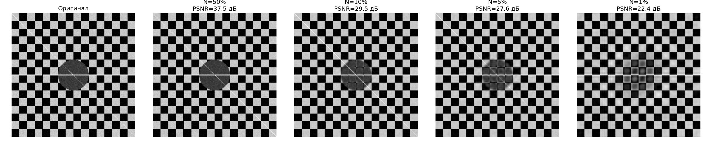
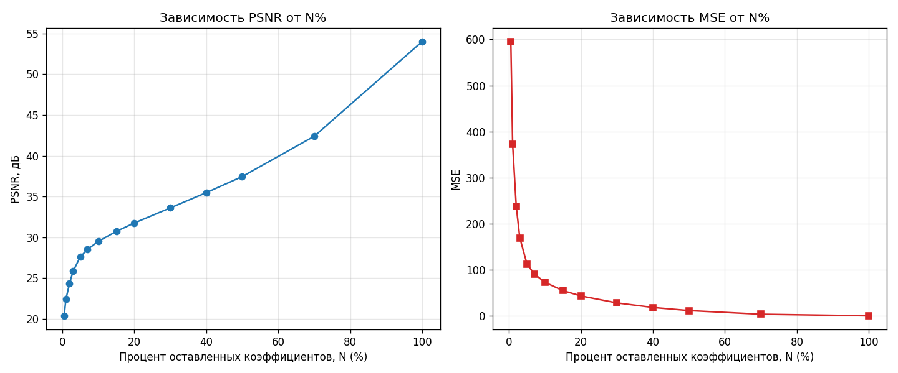

# Задание 17 — Сжатие изображения с помощью усечения спектра Фурье

**Автор:** Бабенко Андрей

## Описание задачи

Реализован алгоритм сжатия изображения, основанный на сохранении только
определённого процента самых больших по амплитуде коэффициентов
двумерного Фурье-спектра.

### Алгоритм

1. Вычисляется двумерное БПФ изображения (`numpy.fft.fft2`).
2. Амплитуды всех частотных коэффициентов сортируются по убыванию
   (через порог `np.partition`, что эквивалентно сортировке, но быстрее).
3. Оставляются только **N%** коэффициентов с наибольшей амплитудой,
   остальные обнуляются.
4. Выполняется обратное БПФ (`numpy.fft.ifft2`) — получается
   восстановленное изображение.
5. Качество сжатия оценивается визуально и через метрики **PSNR**
   (пиковое отношение сигнал/шум) и **MSE** (среднеквадратичная ошибка).
6. Строится график зависимости PSNR и MSE от процента оставленных
   коэффициентов.

### Дополнительное задание

Реализовано сохранение сжатого изображения не как полного массива
спектра, а как **списка индексов и значений** оставшихся (ненулевых)
коэффициентов — через `pickle`. Затем эти данные загружаются обратно
и изображение восстанавливается через обратное БПФ. Проверено, что
результат идентичен прямому восстановлению.

## Структура репозитория

```
fft-image-compression/
├── fft_compression.py      # основной скрипт со всем алгоритмом
├── results/
│   ├── test_image.png      # тестовое изображение (генерируется в коде)
│   ├── comparison.png      # сравнение оригинала и сжатых версий (50%, 10%, 5%, 1%)
│   ├── psnr_vs_percent.png # график PSNR(N%) и MSE(N%)
│   └── compressed_data.pkl # пример сохранённого сжатого представления
└── README.md
```

## Как запустить

```bash
pip install numpy scipy matplotlib pillow
python fft_compression.py
```

Скрипт сам генерирует тестовое изображение в градациях серого
(шахматная доска + круг + линии + шум — специально подобрано так,
чтобы эффект усечения спектра был хорошо заметен визуально).

Чтобы использовать собственное изображение, замените блок генерации
тестового изображения на:

```python
image = np.array(Image.open("ваш_файл.png").convert("L"))
```

## Результаты

### Сравнение качества при разных N%



При уменьшении доли оставленных коэффициентов изображение теряет
резкость, а вокруг резких границ (шахматная доска, край круга)
появляются характерные волнообразные артефакты (эффект Гиббса/ringing) —
типичное следствие отбрасывания высокочастотных компонент спектра.

### Зависимость PSNR и MSE от процента коэффициентов



PSNR растёт монотонно с увеличением N%, с убывающей отдачей после
~30–40% — большая часть энергии изображения сосредоточена в
относительно небольшом числе самых "сильных" коэффициентов спектра,
поэтому даже при умеренном N% качество остаётся приемлемым.

### Пример числовых результатов

| N (%) | MSE     | PSNR (дБ) |
|-------|---------|-----------|
| 50    | 11.7    | 37.5      |
| 10    | 72.8    | 29.5      |
| 5     | 112.5   | 27.6      |
| 1     | 372.4   | 22.4      |

### Дополнительное задание — разреженное хранение

Для N=10% сравнение размера полного спектра и сжатого представления
(индексы + значения ненулевых коэффициентов):

| Представление                    | Размер (байт) |
|-----------------------------------|---------------|
| Полный спектр (complex128)        | 1 048 576     |
| Индексы + значения (сжатое)       | 209 728       |

**Коэффициент сжатия: ×5**

Восстановление изображения из сохранённого файла даёт результат,
полностью идентичный прямому восстановлению (проверено через `assert`
в коде).
